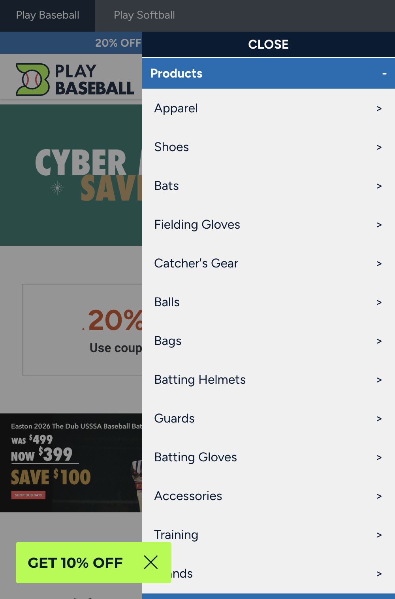
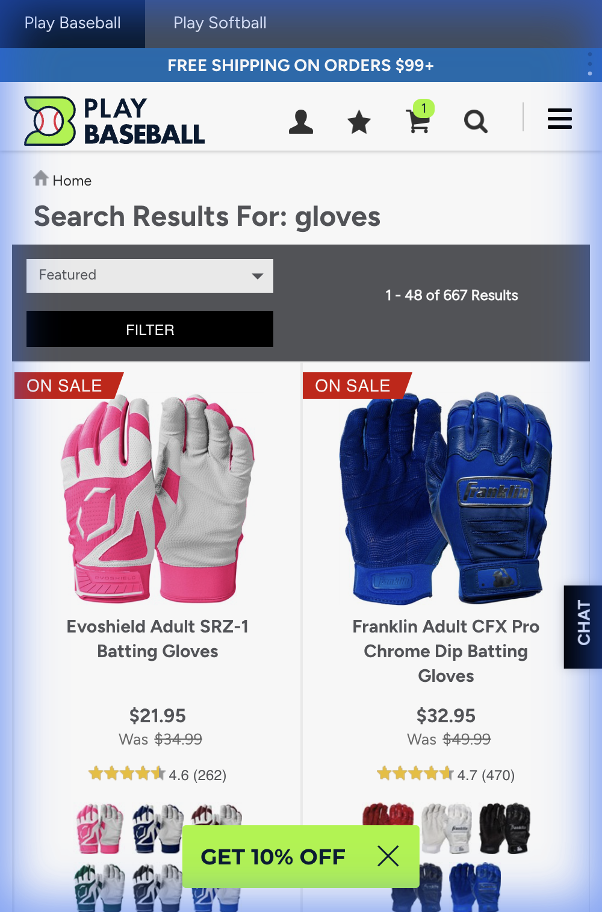
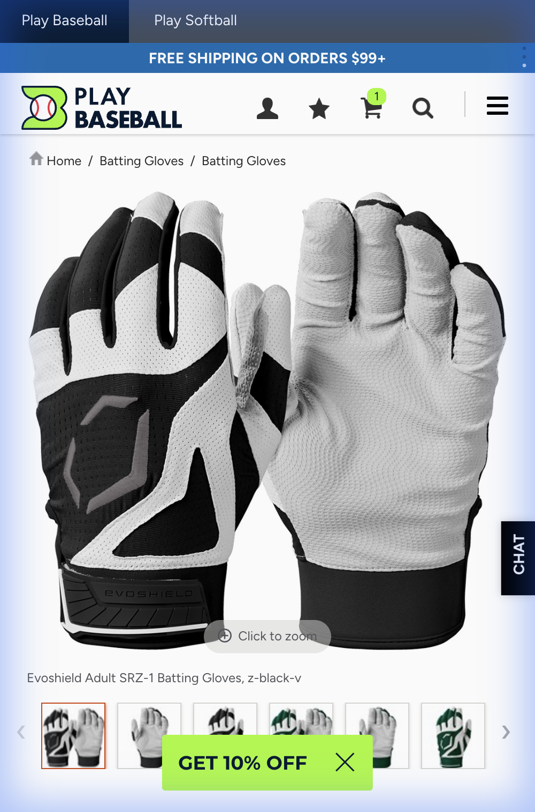

# Mobile Experience Audit: playbaseball.com

## Summary
Mobile experience is functional but desktop-first. Core navigation works; menu interactions and visual hierarchy need improvement.

## 1. Homepage

*   Compact sticky header with clear icons
*   Hamburger menu feels sluggish/unresponsive
    *   

## 2. Product Discovery (PLP)

*   2-column grid layout
*   Product images adequate
*   Touch target sizes need verification

## 3. Product Details (PDP)

*   Clear visual hierarchy
*   Add to Cart should be sticky at bottom

## Key Issues
1.  Menu implementation is heavy/brittle
2.  Heavy JS execution degrades mobile experience
3.  Search prominence is good fallback

## Recommendations
1.  Simplify menu: use semantic HTML and CSS transitions
2.  Ensure 44x44px minimum touch targets
3.  Add sticky Add to Cart on PDP
