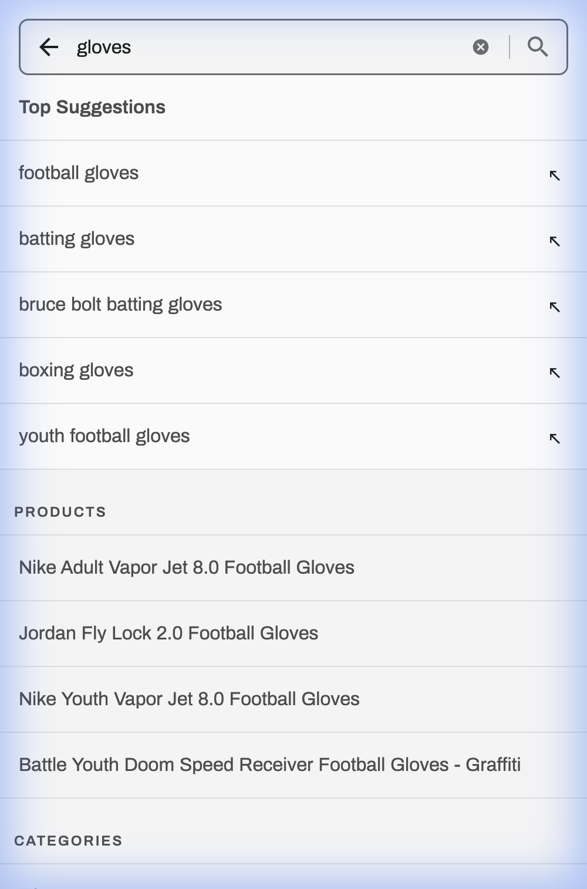
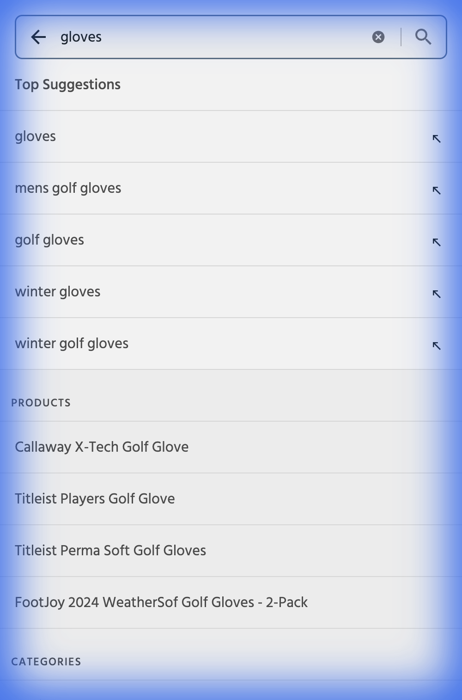
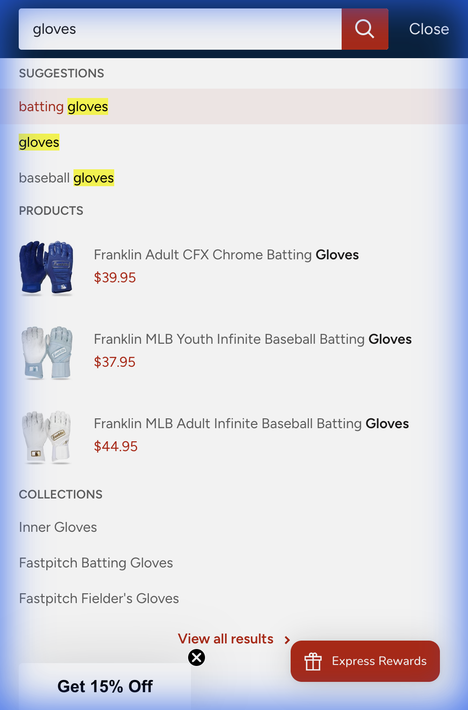

# Competitor Benchmarking: playbaseball.com

## Summary
**playbaseball.com** has a modern backend but lags behind industry leaders (Dick's, Golf Galaxy) in search UX and visual polish. Sportsman's Guide offers a better search experience.

## Competitor Matrix

| Feature               | playbaseball.com     | Dick's Sporting Goods                        | Golf Galaxy                                  | Baseball Express  | Sportsman's Guide        |
| :-------------------- | :------------------- | :------------------------------------------- | :------------------------------------------- | :---------------- | :----------------------- |
| **Sticky Header**     | ✅ Yes                | ✅ Yes (Robust)                               | ✅ Yes (Robust)                               | ✅ Yes             | ✅ Yes                    |
| **Search Experience** | Basic Autosuggest    | 🌟 **Rich Autosuggest** (Images + Categories) | 🌟 **Rich Autosuggest** (Images + Categories) | Basic (Text Only) | Good (Text + Categories) |
| **Cart Prominence**   | High (Icon)          | High (Icon + Count)                          | High (Icon + Count)                          | Medium (Icon)     | High (Icon + Count)      |
| **Mobile UX**         | "Desktop-First" Feel | **Mobile-Optimized**                         | **Mobile-Optimized**                         | Standard          | Standard                 |

## Detailed Analysis

### 1. Dick's Sporting Goods

*   Rich autosuggest with categories, product images, and suggestions
*   **playbaseball.com** lacks this visual richness

### 2. Golf Galaxy

*   Matches Dick's performance

### 3. Baseball Express

*   Similar to **playbaseball.com** current state
*   Text-only search requires extra click

### 4. Sportsman's Guide

*   Better search than **playbaseball.com** with category segmentation
*   Heavy overlay usage creates friction

## Core Web Vitals (Mobile)
*CrUX data, last 28 days*

### Golf Sector Benchmarks

**Product Listing Pages (PLP)**
*Category: Golf Clubs*

| Competitor                | LCP (Loading)      | INP (Interactivity) | CLS (Stability) | Status      |
| :------------------------ | :----------------- | :------------------ | :-------------- | :---------- |
| **Dick's Sporting Goods** | **1.2 s** (Fast)   | 152 ms              | 0               | 🟢 Excellent |
| **Golf Galaxy**           | 1.7 s (Good)       | 195 ms              | 0.05            | 🟢 Good      |
| **Rock Bottom Golf**      | 2.3 s (Needs Imp.) | 145 ms              | 0.06            | 🟡 Fair      |
| **Worldwide Golf Shops**  | 2.8 s (Needs Imp.) | 120 ms              | 0.19            | 🟡 Fair      |
| **TGW.com (Legacy)**      | **3.4 s** (Poor)   | **202 ms** (Poor)   | **0.04**        | 🔴 Lagging   |

**Product Detail Pages (PDP)**
*Category: Drivers*

| Competitor                | LCP (Loading)      | INP (Interactivity) | CLS (Stability) | Status      |
| :------------------------ | :----------------- | :------------------ | :-------------- | :---------- |
| **Dick's Sporting Goods** | **1.0 s** (Fast)   | 120 ms              | 0               | 🟢 Excellent |
| **Worldwide Golf Shops**  | 2.2 s (Needs Imp.) | 105 ms              | 0.06            | 🟡 Fair      |
| **Rock Bottom Golf**      | 2.3 s (Needs Imp.) | 145 ms              | 0.06            | 🟡 Fair      |
| **TGW.com (Legacy)**      | 2.8 s (Needs Imp.) | 120 ms              | 0.19            | 🟡 Fair      |
| **Golf Galaxy**           | 3.0 s (Needs Imp.) | 244 ms              | 0.12            | 🔴 Poor      |

**Key Takeaway:** TGW is 3x slower than Dick's on PLPs (3.4s vs 1.2s LCP).

### Baseball Sector Benchmarks

**Product Listing Pages (PLP)**
*Category: Baseball Bats*

| Competitor           | LCP (Loading)      | INP (Interactivity) | CLS (Stability) | Status |
| :------------------- | :----------------- | :------------------ | :-------------- | :----- |
| **Better Baseball**  | **2.0 s** (Good)   | 149 ms              | 0.09            | 🟢 Good |
| **PlayBaseball.com** | 2.2 s (Needs Imp.) | **105 ms** (Good)   | 0.06            | 🟡 Fair |
| **Baseball Monkey**  | 3.1 s (Poor)       | 145 ms              | 0.02            | 🔴 Poor |

**Product Detail Pages (PDP)**
*Category: Bats*

| Competitor           | LCP (Loading)      | INP (Interactivity) | CLS (Stability) | Status           |
| :------------------- | :----------------- | :------------------ | :-------------- | :--------------- |
| **Better Baseball**  | **1.8 s** (Good)   | 108 ms              | 0.20            | 🟢 Good           |
| **PlayBaseball.com** | 3.0 s (Needs Imp.) | 188 ms              | **0.35**        | 🔴 Poor Stability |

**Key Takeaway:** **playbaseball.com** has best-in-class interactivity (105ms INP) but poor CLS on PDPs (0.35). Better Baseball leads in speed (1.8s LCP).

## Recommendations
1.  Upgrade search UI to rich autosuggest (product thumbnails, category shortcuts)
2.  Improve mobile navigation to match Dick's app-like feel
